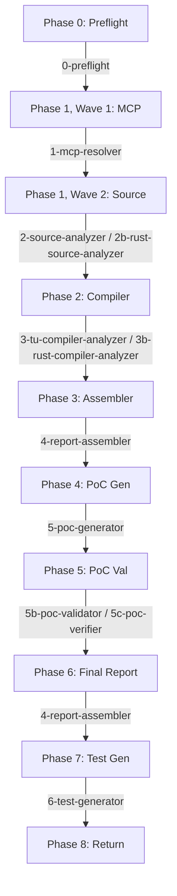

# Zeroize Audit: Agent Architecture and Piplining

The analysis pipeline uses 11 specialized agents across 8 distinct phases, coordinated by the orchestrator. This architecture enables parallel execution and ensures that each agent operates within a manageable context window.

## Agent Definitions

| Agent | Phase | Purpose | Output Directory |
|---|---|---|---|
| `0-preflight` | Phase 0 | Preflight checks (tools, toolchain, compile DB, crate build), config merge, workdir creation, TU enumeration | `{workdir}/` |
| `1-mcp-resolver` | Phase 1, Wave 1 (C/C++ only) | Resolve symbols, types, and cross-file references via Serena MCP | `mcp-evidence/` |
| `2-source-analyzer` | Phase 1, Wave 2a (C/C++ only) | Identify sensitive objects, detect wipes, validate correctness, data-flow/heap | `source-analysis/` |
| `2b-rust-source-analyzer` | Phase 1, Wave 2b (Rust only, parallel with 2a) | Rustdoc JSON trait-aware analysis + dangerous API grep | `source-analysis/` |
| `3-tu-compiler-analyzer` | Phase 2, Wave 3 (C/C++ only, N parallel) | Per-TU IR diff, assembly, semantic IR, CFG analysis | `compiler-analysis/{tu_hash}/` |
| `3b-rust-compiler-analyzer` | Phase 2, Wave 3R (Rust only, single agent) | Crate-level MIR, LLVM IR, and assembly analysis | `rust-compiler-analysis/` |
| `4-report-assembler` | Phase 3 (interim) + Phase 6 (final) | Collect findings from all agents, apply confidence gates; merge PoC results and produce final report | `report/` |
| `5-poc-generator` | Phase 4 | Craft bespoke proof-of-concept programs (C/C++: all categories; Rust: MISSING_SOURCE_ZEROIZE, SECRET_COPY, PARTIAL_WIPE) | `poc/` |
| `5b-poc-validator` | Phase 5 | Compile and run all PoCs | `poc/` |
| `5c-poc-verifier` | Phase 5 | Verify each PoC proves its claimed finding | `poc/` |
| `6-test-generator` | Phase 7 (optional) | Generate runtime validation test harnesses | `tests/` |

## Execution Flow

## Cross-Reference Convention

| Entity | Pattern | Assigned By |
|---|---|---|
| Sensitive object (C/C++) | `SO-0001`–`SO-4999` | `2-source-analyzer` |
| Sensitive object (Rust) | `SO-5000`–`SO-9999` | `2b-rust-source-analyzer` |
| Source finding (C/C++) | `F-SRC-NNNN` | `2-source-analyzer` |
| Source finding (Rust) | `F-RUST-SRC-NNNN` | `2b-rust-source-analyzer` |
| IR finding (C/C++) | `F-IR-{hash}-NNNN` | `3-tu-compiler-analyzer` |
| ASM finding (C/C++) | `F-ASM-{hash}-NNNN` | `3-tu-compiler-analyzer` |
| CFG finding | `F-CFG-{hash}-NNNN` | `3-tu-compiler-analyzer` |
| Semantic IR finding | `F-SIR-{hash}-NNNN` | `3-tu-compiler-analyzer` |
| Rust MIR finding | `F-RUST-MIR-NNNN` | `3b-rust-compiler-analyzer` |
| Rust LLVM IR finding | `F-RUST-IR-NNNN` | `3b-rust-compiler-analyzer` |
| Rust assembly finding | `F-RUST-ASM-NNNN` | `3b-rust-compiler-analyzer` |
| Translation unit | `TU-{hash}` | Orchestrator |
| Final finding | `ZA-NNNN` | `4-report-assembler` |
