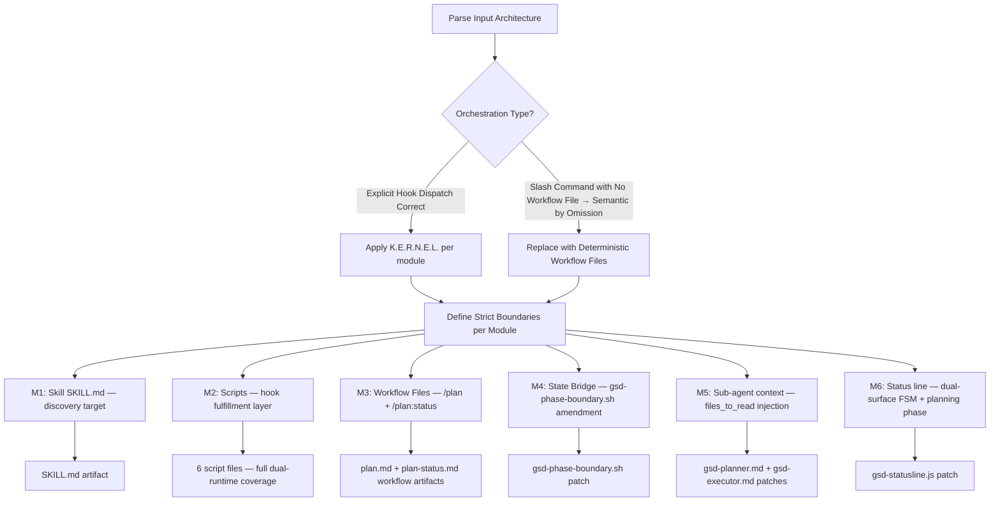

```markdown
# gemini-planning-with-files → antigravity-meta Integration Plan
**Version:** 1.5.2  
**Status:** APPROVED — Ready for Execution  
**Determinism Score:** 9.5/10

---

## Executive Summary

The `antigravity-meta` repository declares `gemini-planning-with-files` integration as complete in its README. It is not. The hook wire-up and rule amendments exist, but the skill directory, its scripts, and its slash-command workflow files are entirely absent. Hooks silently no-op. The commit gate is cosmetic. Sub-agents operate without planning context. This document closes every gap.

---

## Audit: Current State vs. Requirements

| Aspect | Current State | Requirement | Gap |
|--------|--------------|-------------|-----|
| Hook wire-up (`settings.json`) | ✅ All 5 events registered: SessionStart, BeforeTool (Write\|Edit\|Bash\|Read\|Glob\|Grep), AfterTool (Write\|Edit), UserPromptSubmit, Stop | All 5 lifecycle events must fire at correct tool-match scope | None — hooks are wired correctly |
| Hook shell scripts | ✅ 10 files present (.sh + .ps1 pairs for all 5 events) | Dual-runtime shell scripts must exist for all 5 events | None — scripts exist |
| `.agents/skills/planning-with-files/` | ❌ ABSENT — no SKILL.md exists | A discoverable SKILL.md with YAML frontmatter is required for progressive disclosure (Level 1 metadata indexing at session start) | Agent CANNOT self-discover the skill; `gsd-with-persistent-planning.md`'s `requires: skill: planning-with-files` has no fulfillment target |
| Skill scripts (session-catchup.py, check-complete, init-session) | ❌ ABSENT — hooks hardcode `.agents/skills/planning-with-files/scripts/*` paths; files don't exist | session-catchup.py enables structured recovery; check-complete validates commit gate; init-session bootstraps task_plan.md | Hooks silently no-op (exit 0 on missing file) — recovery and commit-gate logic IS GONE despite appearing wired |
| `/plan` and `/plan:status` workflow files | ❌ ABSENT — declared in `hybrid-protocol.md` as registered slash commands; no `.agents/workflows/plan.md` or `plan-status.md` exists | Slash commands require corresponding workflow .md files in `.agents/workflows/` to be dispatched by Antigravity Agent Manager | Typing `/plan` does nothing; declared contract is broken |
| `gsd-with-persistent-planning.md` Phase 1 | References `init-session.sh --from-spec` as step 2 | init-session script must exist to bootstrap task_plan.md from SPEC.md | Phase 1 cannot complete as documented; agent must improvise (semantic drift risk) |
| state.md ↔ task_plan.md bridge | `gsd-session-state.sh` reads state.md FSM stage. `planning-with-files-session-start.sh` reads task_plan.md. They run sequentially but emit independent, unlinked context. Rule G-8 requires state.md to hold a pointer to findings.md — never enforced at hook level | state.md must contain a live pointer to the active task_plan.md/findings.md for FSM ↔ planning coherence | Split-brain session context: FSM stage and planning phase surfaced separately with no cross-reference; Blackboard pattern integrity broken |
| gsd-planner.md / gsd-executor.md sub-agents | `<files_to_read>` blocks in both agent definitions omit task_plan.md, findings.md, progress.md | Sub-agents spawned by orchestrators must load planning context explicitly (hooks don't propagate into spawned sub-agent context) | Sub-agents operate without persistent planning context — goal drift in spawned execution |
| `gsd-statusline.js` status line | Renders FSM stage from state.md only | Status line should surface active planning phase from task_plan.md alongside FSM stage | Split-brain IDE status: user sees FSM stage but not planning phase |
| Rule G-8 enforcement (state.md pointer) | Declared in gsd-core-rules.md as a rule but no hook or workflow mechanically writes the pointer | state.md must be updated with `"Research context: See findings.md"` at Plan phase transition — deterministically | Declarative-only rule with no enforcer — semantic drift risk under load |
| Commit gate strength | check-complete.sh always exits 0 (advisory only) | Gate must be behaviorally binding at agent reasoning level | Gate is cosmetic — agent can ignore it |

---

## Architecture: Six Integration Modules



| Module | Single Goal | Strict Boundary |
|--------|-------------|-----------------|
| M1 | Make `planning-with-files` indexable by Agent Manager | Read-only metadata — never writes state |
| M2 | Deliver the 6 scripts the hooks expect | init-session writes ONLY task_plan.md if absent; session-catchup and check-complete are read-only |
| M3 | Wire `/plan` and `/plan:status` as explicit GSD workflow files | Additive only — must not modify rules, other workflows, or agent definitions. NOT routed through bmad-task-executor (layer violation) |
| M4 | Write deterministic state.md pointer at Plan→Execute transition | Fires ONLY when task_plan.md is written AND Phase 2 complete signal detected |
| M5 | Inject planning file reads into gsd-planner and gsd-executor | Additive `<files_to_read>` entries only — no logic changes |
| M6 | Surface planning phase in IDE status line alongside FSM stage | Read-only — reads task_plan.md first active phase line, never writes |

---

## State Flow After Integration

```
state.md (FSM blackboard)
    └── pointer → task_plan.md (planning blackboard)
                     └── findings.md (external content boundary)
                     └── progress.md (session audit log)
```

---

## Impact

- **M1 SKILL.md**: Agent Manager indexes `planning-with-files` at Level 1 on session start. `gsd-with-persistent-planning.md`'s `requires: skill: planning-with-files` resolves to an actual file. Agent can self-invoke via `Use skill: planning-with-files`.
- **M2 Scripts**: session-catchup now actually runs on SessionStart — structured phase context is injected. check-complete now surfaces a binding message at the Stop hook. init-session bootstraps task_plan.md from SPEC.md atomically.
- **M3 Workflow files**: `/plan` becomes a deterministic dispatch to `plan.md`. `/plan:status` dispatches to `plan-status.md`. No semantic resolution failure. No conflict with BMAD slash commands.
- **M4 State bridge**: state.md holds a live pointer to task_plan.md + findings.md after PLAN phase completes. Rule G-8 is mechanically enforced, not declarative-only.
- **M5 Sub-agent context**: gsd-planner and gsd-executor sub-agents receive planning context in `<files_to_read>`. Goal drift in spawned agents structurally eliminated.
- **M6 Status line**: IDE status bar shows `stage=X | plan=Y` simultaneously.
- **No breaking changes**: All additions are additive. Existing hooks, rules, and workflows are unchanged.
- **Token impact**: ~220 tokens/session added (~150 SKILL.md metadata + ~30 sub-agent file paths + ~40 GEMINI.md constraint).
- **Determinism score: 9.5/10**. Residual 0.5: gsd-phase-boundary.sh bash pattern match is imperative shell, not typed-schema deterministic.

---

## Deployment Artifacts

---

### FILE 1 — `.agents/skills/planning-with-files/SKILL.md`

```markdown
---
name: planning-with-files
description: >
  Provides Manus-style persistent planning memory across sessions using three
  filesystem files: task_plan.md (phased execution plan), findings.md
  (research and decisions log), progress.md (session timeline and error log).
  Use when activating /plan, starting a GSD task requiring 5+ tool calls, or
  resuming after context loss. Hooks fire automatically — no manual invocation
  needed during normal GSD execution. Trigger words: /plan, task_plan, persistent
  planning, session recovery, plan resume, goal drift, context loss.
version: "1.0.0"
source: integrated
---

# planning-with-files

## The Three Files

| File | Purpose | Written by |
|------|---------|------------|
| `task_plan.md` | Phased execution plan with step status | Agent at PLAN phase |
| `findings.md` | Research, decisions, external content ONLY | Agent (2-Action Rule) |
| `progress.md` | Session log, errors, test results | Agent (AfterTool hook) |

## Critical Constraint (Rule G-9)
`task_plan.md` is injected into context before EVERY tool call (BeforeTool hook).
Never write external fetched content here. External content → `findings.md` only.

## Scripts

| Script | Purpose | Runtime |
|--------|---------|---------|
| [init-session.sh](file:///agents/skills/planning-with-files/scripts/init-session.sh) | Bootstrap task_plan.md from SPEC.md (idempotent) | Bash |
| [init-session.ps1](file:///agents/skills/planning-with-files/scripts/init-session.ps1) | Same — Windows runtime | PowerShell |
| [session-catchup.py](file:///agents/skills/planning-with-files/scripts/session-catchup.py) | Emit structured session status on startup | Python 3 |
| [session-catchup.ps1](file:///agents/skills/planning-with-files/scripts/session-catchup.ps1) | Same — Windows fallback | PowerShell |
| [check-complete.sh](file:///agents/skills/planning-with-files/scripts/check-complete.sh) | Validate all phases complete before commit | Bash |
| [check-complete.ps1](file:///agents/skills/planning-with-files/scripts/check-complete.ps1) | Same — Windows runtime | PowerShell |

## Extended GSD Workflow
See [gsd-with-persistent-planning.md](file:///agents/workflows/gsd-with-persistent-planning.md)
```

---

### FILE 2 — `.agents/skills/planning-with-files/scripts/init-session.sh`

```bash
#!/usr/bin/env bash
cd "$(dirname "$(realpath "$0")")/../../../.." || exit 1
set -u

PLAN_FILE="task_plan.md"
SPEC_FILE="SPEC.md"
FROM_SPEC=false
[[ "${1:-}" == "--from-spec" ]] && FROM_SPEC=true

if [ -f "$PLAN_FILE" ]; then
  echo "[planning-with-files] task_plan.md already exists. Skipping init."
  exit 0
fi

GOAL="[Derived from SPEC.md — update this line]"
if $FROM_SPEC && [ -f "$SPEC_FILE" ]; then
  GOAL="$(grep -m1 '##\|^#\|Goal\|Problem' "$SPEC_FILE" 2>/dev/null | head -c 120 || echo "$GOAL")"
fi

cat > "$PLAN_FILE" << EOF
# Task Plan
**Goal:** ${GOAL}
**Created:** $(date -u +%Y-%m-%dT%H:%M:%SZ)

## Phase 1: Spec
**Status:** in_progress
- [ ] Define requirements in SPEC.md

## Phase 2: Plan
**Status:** not_started

## Phase 3: Execute
**Status:** not_started

## Phase 4: Verify
**Status:** not_started

## Phase 5: Commit
**Status:** not_started

## Errors
| Error | Attempt # | Resolution | GSD Phase |
|-------|-----------|------------|-----------|
EOF
echo "[planning-with-files] task_plan.md initialized."
exit 0
```

---

### FILE 3 — `.agents/skills/planning-with-files/scripts/init-session.ps1`

```powershell
$scriptDir = Split-Path -Parent $MyInvocation.MyCommand.Path
Set-Location (Resolve-Path "$scriptDir/../../../..").Path

param([string]$Flag = "")
$PLAN_FILE = "task_plan.md"
$SPEC_FILE = "SPEC.md"
$FromSpec = $Flag -eq "--from-spec"

if (Test-Path $PLAN_FILE) {
    Write-Host "[planning-with-files] task_plan.md already exists. Skipping init."
    exit 0
}

$Goal = "[Derived from SPEC.md — update this line]"
if ($FromSpec -and (Test-Path $SPEC_FILE)) {
    $Line = Get-Content $SPEC_FILE |
        Where-Object { $_ -match "^#|Goal|Problem" } |
        Select-Object -First 1
    if ($Line) { $Goal = $Line.Substring(0, [Math]::Min(120, $Line.Length)) }
}

$TS = (Get-Date -Format "yyyy-MM-ddTHH:mm:ssZ")
$Content = @"
# Task Plan
**Goal:** $Goal
**Created:** $TS

## Phase 1: Spec
**Status:** in_progress
- [ ] Define requirements in SPEC.md

## Phase 2: Plan
**Status:** not_started

## Phase 3: Execute
**Status:** not_started

## Phase 4: Verify
**Status:** not_started

## Phase 5: Commit
**Status:** not_started

## Errors
| Error | Attempt # | Resolution | GSD Phase |
|-------|-----------|------------|-----------|
"@
Set-Content $PLAN_FILE $Content
Write-Host "[planning-with-files] task_plan.md initialized."
exit 0
```

---

### FILE 4 — `.agents/skills/planning-with-files/scripts/session-catchup.py`

```python
#!/usr/bin/env python3
import sys
import os
from pathlib import Path

# Anchor to repo root: script lives 4 levels deep under repo root
script_dir = Path(__file__).resolve().parent
repo_root = script_dir.parents[3]
os.chdir(repo_root)

cwd = Path(sys.argv[1]) if len(sys.argv) > 1 else repo_root
plan = cwd / "task_plan.md"
progress = cwd / "progress.md"

if not plan.exists():
    sys.exit(0)

lines = plan.read_text(encoding="utf-8").splitlines()
goal = next(
    (l.replace("**Goal:**", "").strip() for l in lines if "**Goal:**" in l),
    "unknown"
)
active = next((l.strip() for l in lines if "in_progress" in l), None)

print(f"\n[planning-with-files] CATCHUP: goal={goal}")
if active:
    print(f"[planning-with-files] ACTIVE PHASE: {active}")
else:
    print("[planning-with-files] All phases complete or no active phase.")

if progress.exists():
    tail = progress.read_text(encoding="utf-8").splitlines()[-5:]
    print("[planning-with-files] LAST PROGRESS:")
    for line in tail:
        print(f"  {line}")
print()
```

---

### FILE 5 — `.agents/skills/planning-with-files/scripts/session-catchup.ps1`

```powershell
$scriptDir = Split-Path -Parent $MyInvocation.MyCommand.Path
Set-Location (Resolve-Path "$scriptDir/../../../..").Path

param([string]$ProjectRoot = (Get-Location).Path)
$PlanFile = Join-Path $ProjectRoot "task_plan.md"
$ProgressFile = Join-Path $ProjectRoot "progress.md"

if (-not (Test-Path $PlanFile)) { exit 0 }

$Lines = Get-Content $PlanFile
$Goal = ($Lines |
    Where-Object { $_ -match "\*\*Goal:\*\*" } |
    Select-Object -First 1) -replace "\*\*Goal:\*\*", "" -replace "^\s+|\s+$", ""
if (-not $Goal) { $Goal = "unknown" }
$Active = $Lines |
    Where-Object { $_ -match "in_progress" } |
    Select-Object -First 1

Write-Host "`n[planning-with-files] CATCHUP: goal=$Goal"
if ($Active) {
    Write-Host "[planning-with-files] ACTIVE PHASE: $($Active.Trim())"
} else {
    Write-Host "[planning-with-files] All phases complete or no active phase."
}

if (Test-Path $ProgressFile) {
    $Tail = Get-Content $ProgressFile | Select-Object -Last 5
    Write-Host "[planning-with-files] LAST PROGRESS:"
    $Tail | ForEach-Object { Write-Host "  $_" }
}
Write-Host ""
exit 0
```

---

### FILE 6 — `.agents/skills/planning-with-files/scripts/check-complete.sh`

```bash
#!/usr/bin/env bash
cd "$(dirname "$(realpath "$0")")/../../../.." || exit 1
set -u

PLAN_FILE="task_plan.md"

if [ ! -f "$PLAN_FILE" ]; then
  echo "[planning-with-files] No task_plan.md found. Skipping check."
  exit 0
fi

INCOMPLETE=$(grep -cE "\*\*Status:\*\* (not_started|in_progress)" "$PLAN_FILE" 2>/dev/null || echo "0")

if [ "$INCOMPLETE" -gt 0 ]; then
  echo "[planning-with-files] COMMIT BLOCKED: $INCOMPLETE phase(s) incomplete."
  echo "[planning-with-files] You MUST complete all phases before committing (GEMINI.md §commit-gate)."
  echo "[planning-with-files] Run /plan:status to see outstanding phases."
else
  echo "[planning-with-files] ALL PHASES COMPLETE. Commit gate passed."
fi
exit 0
```

---

### FILE 7 — `.agents/skills/planning-with-files/scripts/check-complete.ps1`

```powershell
$scriptDir = Split-Path -Parent $MyInvocation.MyCommand.Path
Set-Location (Resolve-Path "$scriptDir/../../../..").Path

$PlanFile = "task_plan.md"
if (-not (Test-Path $PlanFile)) {
    Write-Host "[planning-with-files] No task_plan.md found. Skipping check."
    exit 0
}

$Incomplete = (Get-Content $PlanFile |
    Where-Object { $_ -match "\*\*Status:\*\* (not_started|in_progress)" }).Count

if ($Incomplete -gt 0) {
    Write-Host "[planning-with-files] COMMIT BLOCKED: $Incomplete phase(s) incomplete."
    Write-Host "[planning-with-files] You MUST complete all phases before committing (GEMINI.md §commit-gate)."
    Write-Host "[planning-with-files] Run /plan:status to see outstanding phases."
} else {
    Write-Host "[planning-with-files] ALL PHASES COMPLETE. Commit gate passed."
}
exit 0
```

---

### FILE 8 — `.agents/workflows/plan.md`

```markdown
---
name: plan
description: >
  Initialize or resume persistent planning for the current GSD task.
  Creates task_plan.md, findings.md, and progress.md if absent.
  Resumes from active phase if they exist. Slash command: /plan
---

# /plan — Initialize or Resume Persistent Planning

**$1** (optional: task description or "resume")

1. **Check for existing plan:**
   Read `task_plan.md` if it exists → skip to Step 3.

2. **Bootstrap (new plan only):**
   Run (Bash): `bash .agents/skills/planning-with-files/scripts/init-session.sh --from-spec`
   Run (PS):   `pwsh .agents/skills/planning-with-files/scripts/init-session.ps1 --from-spec`
   Confirm `task_plan.md` created.

3. **Restore context:**
   Read `task_plan.md` completely.
   If `findings.md` exists → read Architecture and Research sections.
   If `progress.md` exists → read last 20 lines.

4. **Report:**
   Output: "Planning active. Current phase: [phase]. Next action: [first incomplete task]."
   If all phases complete → output: "All phases complete. Commit gate will pass."
```

---

### FILE 9 — `.agents/workflows/plan-status.md`

```markdown
---
name: plan-status
description: >
  Print a read-only health summary of task_plan.md, findings.md, and progress.md.
  Never modifies files. Slash command: /plan:status
---

# /plan:status — Planning Health Summary

1. Read `task_plan.md` → extract all Phase names and statuses.
2. Read `progress.md` (last 10 lines) → show recent session activity.
3. Check `findings.md` exists → confirm research context available.

Output this exact table:

| File | Present | Active Phase / Last Entry |
|------|---------|--------------------------|
| task_plan.md | yes/no | [phase + status] |
| findings.md | yes/no | n/a |
| progress.md | yes/no | [last timestamp line] |

Run check-complete:
`bash .agents/skills/planning-with-files/scripts/check-complete.sh`
(PS: `pwsh .agents/skills/planning-with-files/scripts/check-complete.ps1`)
Append commit-gate verdict to status output.
```

---

### PATCH 1 — `GEMINI.md` commit gate block

Add under a `## Commit Gate` section:

```markdown
## Commit Gate (planning-with-files)

Before ANY `git commit` during a GSD session where `task_plan.md` exists:

1. Run `.agents/skills/planning-with-files/scripts/check-complete.sh`
   (Windows: `check-complete.ps1`)
2. Read the output completely.
3. If output contains "COMMIT BLOCKED" → you MUST NOT proceed with the commit.
   Update outstanding phases in `task_plan.md` first, then re-run the check.
4. Only proceed to commit when output contains "ALL PHASES COMPLETE".

This constraint is MANDATORY. It overrides any other instruction to commit.
```

---

### PATCH 2 — `gsd-planner.md` `<files_to_read>` addition

```
- task_plan.md (if exists — active persistent plan; read before any planning decision)
- findings.md (if exists — research context, prior decisions, Architecture section)
```

---

### PATCH 3 — `gsd-executor.md` `<files_to_read>` addition

```
- task_plan.md (if exists — active persistent plan; align all tool calls to active phase)
- progress.md (if exists — prior session errors; never repeat a failed approach)
```

---

### PATCH 4 — `gsd-phase-boundary.sh` state bridge

Add after existing phase-boundary logic:

```bash
if echo "${EDITED_FILE:-}" | grep -q "task_plan.md"; then
  STATE_MD="state.md"
  if [ -f "$STATE_MD" ] && ! grep -q "Planning Context" "$STATE_MD"; then
    echo "**Planning Context:** See task_plan.md + findings.md" >> "$STATE_MD"
  fi
fi
```

---

## Activation Sequence — Final (Immutable Order)

```
1.  Create .agents/skills/planning-with-files/SKILL.md              ← FILE 1
2.  Create scripts/init-session.sh                                   ← FILE 2
3.  Create scripts/init-session.ps1                                  ← FILE 3
4.  Create scripts/session-catchup.py                                ← FILE 4
5.  Create scripts/session-catchup.ps1                               ← FILE 5
6.  Create scripts/check-complete.sh                                 ← FILE 6
7.  Create scripts/check-complete.ps1                                ← FILE 7
8.  Create .agents/workflows/plan.md                                 ← FILE 8
9.  Create .agents/workflows/plan-status.md                          ← FILE 9
10. Apply GEMINI.md commit gate block                                 ← PATCH 1
11. Apply gsd-planner.md files_to_read injection                     ← PATCH 2
12. Apply gsd-executor.md files_to_read injection                    ← PATCH 3
13. Apply gsd-phase-boundary.sh state bridge                         ← PATCH 4
14. Run /self-audit → verify SKILL.md indexed, 0 char violations
15. Run /plan in fresh session → confirm deterministic dispatch
```

---

## Verification Gate

After step 15, `/plan` typed into Agent Manager **must** dispatch deterministically to `plan.md` and execute the 4-step init/resume sequence. If Agent Manager instead asks *"what would you like to plan?"* without running the bootstrap script, M3 is not wired — check that `plan.md` has valid YAML frontmatter and is present in `.agents/workflows/`.

**Integration is confirmed when:** `/plan` outputs `"Planning active. Current phase: [phase]. Next action: [task]."` without any semantic fallback behavior.

```
